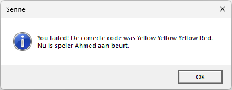
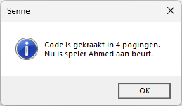
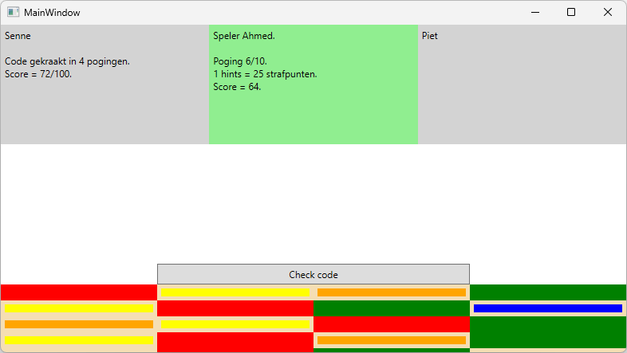

# Finale versie Mastermind

In deze sprint gaan we de finale versie opleveren van ons spel. Hiervoor moeten er nog wat uitbreidingen geprogrammeerd worden.

**Spelverloop:**

- Vraag stellen om nog een speler toe te voegen
- Na het einde van het spel, de volgende speler laten spelen. De messagebox na einde spel (WINNER of FAILED) uitbreiden om de naam van de volgende speler tonen.
- Per speler een rectangle tonen met met zijn/haar score.
- Achtergrondkleur aanpassen voor actieve speler.
- Hint kopen
- Tooltip tonen

### Functionele vereisten

| ID | Onderwerp | Beschrijving |
| :--- | :--- | :--- |
| Mastermind-12 | Extra spelers | In de methode *startgame* wordt nu de naam van de speler gevraagd. Wijzig dit zodat er namen van meerdere spelers ingegeven kunnen worden. Na het vragen van de naam van de eerste speler stel je de vraag of men nog een speler wil toevoegen. Dit blijf je doen tot men hierop *Nee* antwoordt. De spelernamen voeg je toe aan een generic list. |
| Mastermind-13 | Speleinde | Na een speleinde is de volgende speler aan de beurt. In de bestaande melding die je nu toont (zie Mastermind-09 en Mastermind-PE2-03) ga je nu ook de naam van de volgende speler tonen.   |
| Mastermind-14 | Huidige speler | Omdat ons spel nu met meerdere spelers kan gespeeld worden, moet duidelijk getoond worden wie de actieve speler is. Momenteel toon je het aantal pogingen en de score in een label (Mastermind-08). Breid dit uit met de naam van de huidige speler. |
| Mastermind-15 | Hint | We gaan de mogelijkheid geven om een hint te kopen. De speler heeft de keuze tussen een juiste kleur en een juiste kleur op de juiste plaats. Het spreekt voor zich dat dit niet gratis is. Een juiste kleur kost 15 strafpunten en een juiste kleur op de juiste plaats kost 25 strafpunten. Maak hiervoor gebruik van een berichtventer. |
| Mastermind-16 | Tooltip | Wanneer een speler een gok heeft gewaagd wordt hiervan feedback gegeven in de vorm van een witte of rode rand (zie Mastermind-05). Om het voor de speler duidelijker te maken gaan we een tooltip voorzien. Voorzie onderstaande teksten: witte rand: "Juiste kleur, foute positie" rode rand: "Juiste kleur, juiste positie" geen kleur: "Foute kleur" |
| Extra-01 | Meer kleuren | Momenteel is het voorzien om met 4 kleuren te spelen. Breid je spel uit zodat de speler de keuze heeft tussen 4, 5 of 6 kleuren. |
| Extra-02 | Actieve speler | Breid Mastermind-14 uit zodat je voor elke speler een label voorziet. Alle labels zijn constant zichtbaar, dus ook van de spelers die hun spel al beëindigd hebben. Voor de actieve speler voorzie je een andere achtergrondkleur.  |
